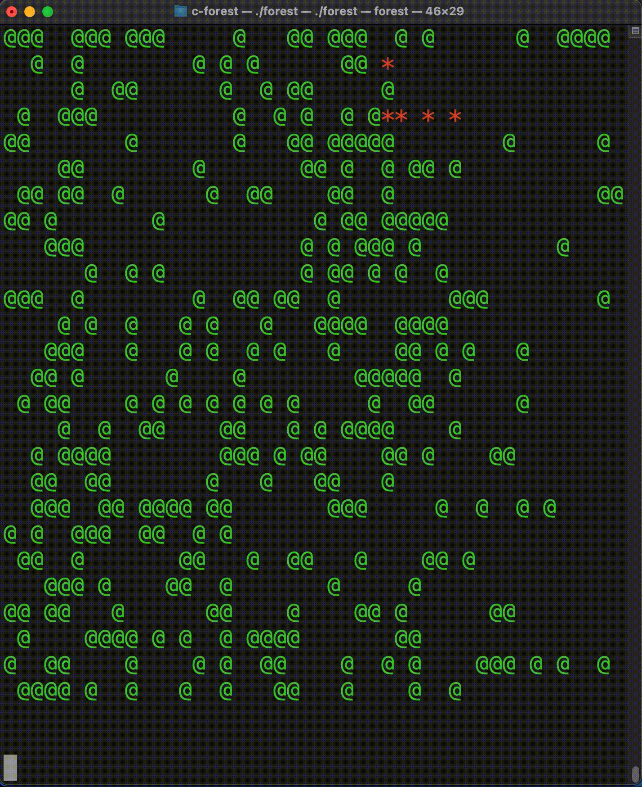

<h1 align="center">
  <br>
    </a>
  <br>
  Forest Fires
  <br>
</h1>

<h4 align="center">A 2D cellular automata developed in C to simulate the propagation of fires in a forest.</h4>

<p align="center">
  <a href="#Features">Features</a> |
  <a href="#Overview">Overview</a> |
  <a href="#License">License</a>
</p>

<p align="center">

</p>

# Features
- Tuning parameters such as tree growth rate `(G)` and fire probability `(L)`
- Test driven development using assertions
- C99 compliant

# Overview
This project is a simple model of forest fires using a cellular automaton in the form of a 2D grid of cells. Each cell can be in one of three states; either ‘empty’, ‘tree’, or ‘fire’. 

Every discrete time step, the next generation of cells follow these rules:
- A ‘fire’ cell will turn into an ‘empty’ cell
- A ‘tree’ that is within the 8-neighbourhood of a ‘fire’ cell will itself become ‘fire’. 
- A ‘tree’ will burn (due to a lightning strike) 1 time in `L`
- An ‘empty’ space will become a ‘tree’ (spontaneous growth) 1 time in `G`

# Usage
Ensure you have [GCC](https://gcc.gnu.org) installed on your machine. Once you have done so, run the following command on your terminal:

```bash
make forest
```

Run the executable by then typing in the following command on your terminal:

```bash
./forest
```


# License

```
Copyright (c) 2021 Keane Fernandes

Permission is hereby granted, free of charge, to any person obtaining a copy
of this software and associated documentation files (the "Software"), to deal
in the Software without restriction, including without limitation the rights
to use, copy, modify, merge, publish, distribute, sublicense, and/or sell
copies of the Software, and to permit persons to whom the Software is
furnished to do so, subject to the following conditions:

The above copyright notice and this permission notice shall be included in all
copies or substantial portions of the Software.

THE SOFTWARE IS PROVIDED "AS IS", WITHOUT WARRANTY OF ANY KIND, EXPRESS OR
IMPLIED, INCLUDING BUT NOT LIMITED TO THE WARRANTIES OF MERCHANTABILITY,
FITNESS FOR A PARTICULAR PURPOSE AND NONINFRINGEMENT. IN NO EVENT SHALL THE
AUTHORS OR COPYRIGHT HOLDERS BE LIABLE FOR ANY CLAIM, DAMAGES OR OTHER
LIABILITY, WHETHER IN AN ACTION OF CONTRACT, TORT OR OTHERWISE, ARISING FROM,
OUT OF OR IN CONNECTION WITH THE SOFTWARE OR THE USE OR OTHER DEALINGS IN THE
SOFTWARE.
```
